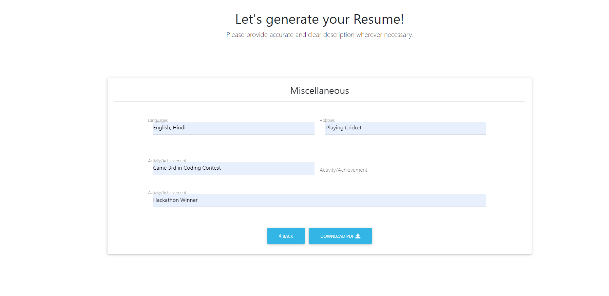
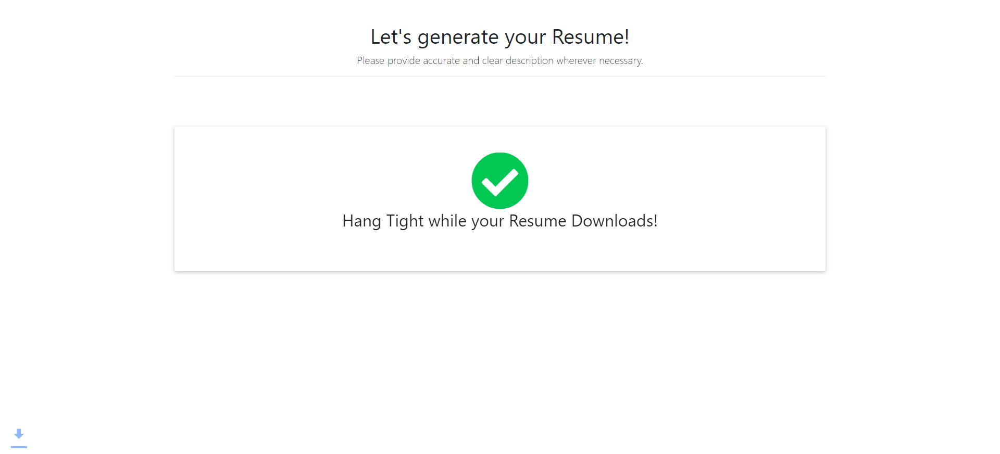

# [Resume-Builder](http://lk-resumebuilder.herokuapp.com/) ⭐

&nbsp;
&nbsp;
&nbsp;
&nbsp;
&nbsp;<br/>
&nbsp;
&nbsp;
&nbsp;


[](http://lk-resumebuilder.herokuapp.com/)
[](https://github.com/ROHAN842/Resume-Builder)

## Overview 👀




- Build Resume and get ready for internships & placement 👨‍💻
- Clean UI ⚡
- User can easily toggle between any two successive pages by using Back ⬅️ and Next ➡️ buttons
- While toggling between successive pages user's data will be completely saved 💾 in form templates made using react.js  
- After filling all information, download resume in PDF 📁 format
- Success notification is being displayed to user whie resume is downloading with a green tick ✅

## What is Resume Builder? 🤔

#### Resume Builder is basically a website for generating resume. 
#### The front end of Resume Builder is purely made with react.js, while the back end is made with Nodejs and Expressjs.
#### Alongwith 'axios' and 'file-saver' packages are used in it for generating pdf and saving the details entered by the user at the server side.


## How it works? 🤔
- **Open the website [http://lk-resumebuilder.herokuapp.com/](http://lk-resumebuilder.herokuapp.com/)**
- **Fill all the relevant information present in 4-5 pages such as Project details, Experience Info, Education Info, Extra Curriculars/Activities Details.**
- **At last click on Download PDF button and in few seconds resume will be downloaded in PDF format.**

## Dependencies 🗃

- [React.js](https://reactjs.org/) - **Frontend Framework**
- [Node.js](https://nodejs.org/en/) - **Backend Framework**
- [Express.js](https://expressjs.com/) - **Server Side Node.js Framework**

## Run Locally 💻

```
> Clone the repo
    >> For Windows: Git Bash
    >> For Linux: Terminal
    >> git clone https://github.com/ROHAN842/Resume-Builder.git
    >> cd MainFolder/DirectoryName
> Install all dependencies
    >> npm i
> Spin the server on port 5000
    >> cd MainFolder/DirectoryName
    >> nodemon or node index.js
> Spin the react on port 3000
    >> cd client
    >> npm start
> Visit the website on http://localhost:3000/
    
```
